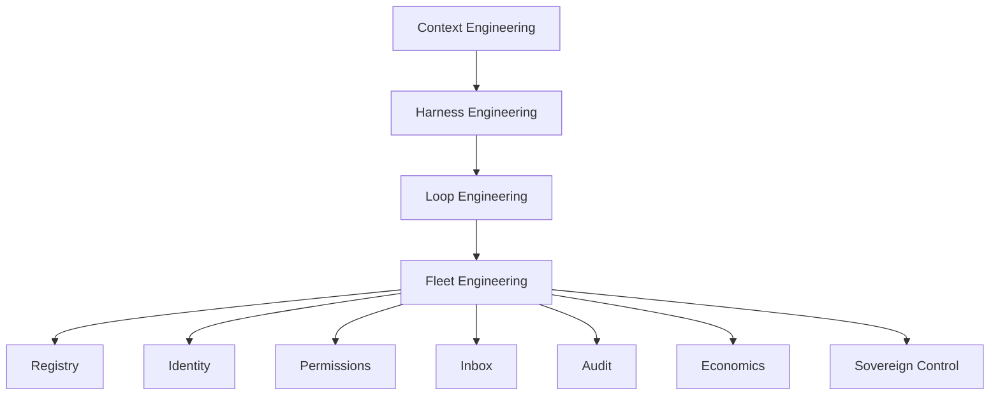

# Concepts & Vocabulary

Fleet engineering sits one layer above loop engineering. This glossary links the stack so you can design fleets with the right mental model.

## Fleet Engineering

**Replacing ad-hoc agent populations with accountable organization.** You design registry, identity, permissions, inbox, audit, economics, and sovereign control — so many loops and agents can run across a team without chaos.

A fleet is a **governed population**, not a folder of prompts.

## The Accountability Test

If you cannot complete this sentence for any action, you have a population — not a fleet:

> *Which agent did it, with what authority, against what task, evidenced by what?*

See [accountability-test.md](./accountability-test.md).

## Related Concepts

### Context Engineering

What the model sees at each inference. Subset of harness; prerequisite for any agent.

### Harness Engineering

The environment **one agent run** executes in: tools, sandboxes, memory, verification, permissions.

```
Harness = single session / single run
Loop    = harness + schedule + state + verification chain
Fleet   = many loops/agents + registry + identity + org-wide control
```

### Loop Engineering

The system that **replaces you as the prompter** for one autonomous workflow. See [loop-engineering](https://github.com/cobusgreyling/loop-engineering).

Fleet engineering begins when:
- Multiple loops collide or compete for resources
- Multiple people create agents without a catalog
- Compliance asks "who did this?"
- Token spend is nobody's job to watch

### Population vs Fleet

| Population | Fleet |
|------------|-------|
| Agents exist because someone made them | Agents are registered with owners |
| Credentials are shared or unknown | Identity model is explicit (claw vs assistant) |
| Permissions are implicit | clone / run / edit is enforced |
| Debugging is per-agent | Audit trail is cross-agent |
| Kill = delete a chat | Kill switch affects subsets or whole fleet |

### Claw vs Assistant (LangSmith Fleet terms)

- **Claw**: fixed credentials; acts as a team resource (e.g. shared Linear bot)
- **Assistant**: acts on behalf of invoking user; OAuth per user; permissions follow the human

These map to **identity & credentials** — one of the five fleet concerns.

## The Five Concerns (+ Registry)

See [five-concerns.md](./five-concerns.md).

1. **Topology** — how agents relate (hierarchical, P2P, blackboard, router)
2. **Choreography** — how work flows (workflows, events, handoffs)
3. **Identity & trust** — who acted, on whose behalf
4. **Resource economics** — budgets, quotas, admission control
5. **Sovereign control** — kill switches, rollback, autonomy tiers

**Registry** is the spine that makes the five concerns operable at scale.

## Concept Map



## Maturity Levels (F0–F3)

| Level | Name | Posture |
|-------|------|---------|
| F0 | Ad-hoc | Agents everywhere; no catalog |
| F1 | Cataloged | Registry + permissions doc; inbox for risky actions |
| F2 | Shared | Team agents, budgets, cross-agent audit |
| F3 | Enterprise | Policy-as-code, kill switches, SLOs, compliance |

See [maturity-model.md](./maturity-model.md).

## Further Reading

- [Stack](./stack.md) — full progression trail
- [loop-engineering concepts](https://github.com/cobusgreyling/loop-engineering/blob/main/docs/concepts.md)
- [LangSmith Fleet announcement](https://www.langchain.com/blog/introducing-langsmith-fleet)