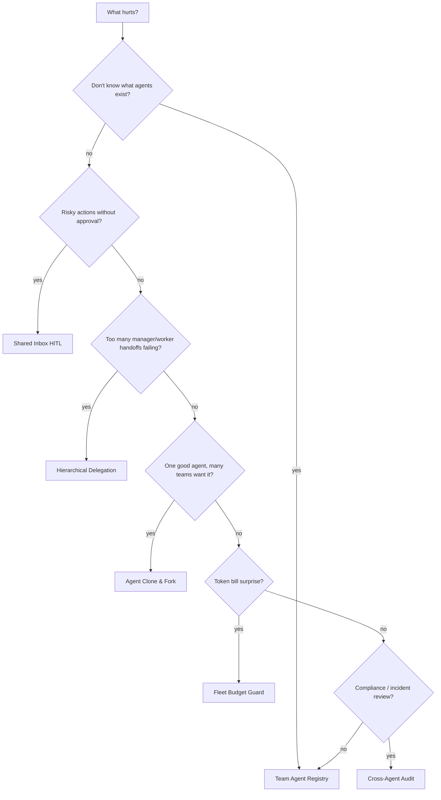

# Which Fleet Pattern When?

Pick one primary pattern per organizational pain. Overlapping patterns need coordination — see [multi-fleet.md](./multi-fleet.md).

## Quick reference

| Symptom | Pattern | Start with |
|---------|---------|------------|
| "We have agents everywhere" | [Team Agent Registry](../patterns/team-agent-registry.md) | **F1** catalog only |
| Agents act without oversight | [Shared Inbox HITL](../patterns/shared-inbox-hitl.md) | F1 approve-only |
| Manager loop loses track of workers | [Hierarchical Delegation](../patterns/hierarchical-delegation.md) | F1 typed handoffs |
| One agent should serve many teams | [Agent Clone & Fork](../patterns/agent-clone-fork.md) | F1 clone policy |
| Spend growing silently | [Fleet Budget Guard](../patterns/fleet-budget-guard.md) | **F1** caps only |
| "Who did this?" in incident | [Cross-Agent Audit](../patterns/cross-agent-audit.md) | F1 read-only audit |

## Recommended first week (most teams)

1. **Team Agent Registry** — inventory what exists
2. **Fleet Budget Guard** — caps before scale
3. **Shared Inbox HITL** — before any L2+ loops go unattended

## Overlap rules

| Combination | Rule |
|-------------|------|
| Registry + anything | Registry first; no new agents without manifest |
| Budget Guard + Hierarchical Delegation | Manager loop inherits team budget; workers inherit sub-caps |
| Clone & Fork + Registry | Clones must register as new IDs with `forked_from` |
| Audit + Inbox | Inbox approvals are audit events — link IDs |

## Prerequisite

If you do not yet have stable **loops**, start with [loop-engineering](https://github.com/cobusgreyling/loop-engineering) first. Fleet patterns assume at least one loop pattern is understood.