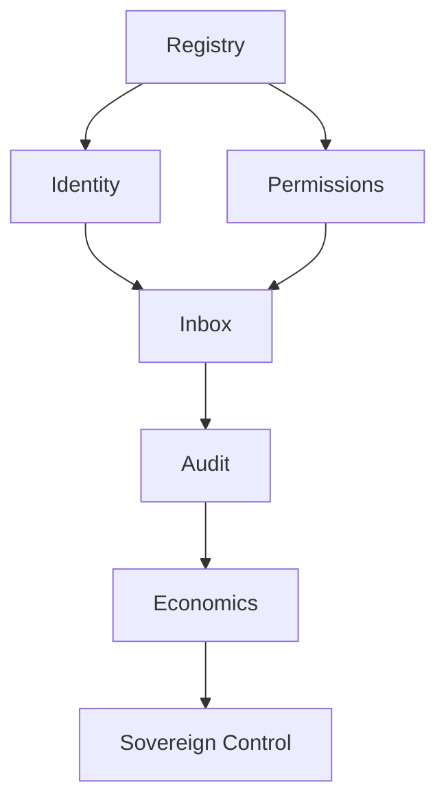

# Fleet Primitives

Seven primitives that compose a fleet control plane. Each solves an organizational problem that loop engineering does not.

## 1. Registry

**Job:** Single source of truth for what agents exist.

- Agent ID, owner, version, status (active / paused / retired)
- Linked loop pattern(s) and skills
- Last reviewed date

Artifacts: `FLEET-STATE.md`, `agents/registry.yaml`, or platform workspace catalog.

## 2. Identity & Credentials

**Job:** Define who the agent acts as.

| Mode | Behavior | Example |
|------|----------|---------|
| Claw | Fixed service credentials | `@vendor-intake` Slack bot |
| Assistant | Per-user OAuth | Personal Notion assistant |

Without this, audit fails at "with what authority?"

## 3. Permissions & Sharing

**Job:** Control who can clone, run, or edit each agent.

LangSmith Fleet levels:
- **Can clone** — fork to customize
- **Can run** — use without editing config
- **Can edit** — full configuration access

## 4. Inbox / Escalation

**Job:** One place for humans to approve, reject, or review agent actions across the fleet.

- Claw agents: editors see fleet-wide threads
- Assistant agents: private per-user inbox for sensitive work

## 5. Observability & Audit

**Job:** Cross-agent traces and searchable evidence.

Minimum: tool calls + decisions + principal + agent version.  
Enterprise: retention, export, correlation across handoffs.

## 6. Economics

**Job:** Prevent runaway spend and attribute cost.

- Per-agent daily token caps
- Per-team monthly budgets
- Admission control when over cap
- Cheap triage loops before expensive sub-agents

Template: [templates/fleet-budget.md](../templates/fleet-budget.md)

## 7. Sovereign Control

**Job:** Organization retains kill and recovery authority.

- `FLEET_PAUSE_ALL` or platform kill switch
- Autonomy tiers (F1–F3) per agent class
- Rollback to last known-good manifest

## Primitive Dependency Graph

You can start with Registry + Permissions (F1) before full audit infrastructure.