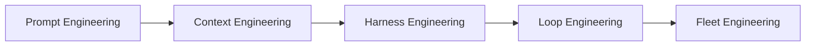

# The Agent Engineering Stack

A trail from prompt to fleet. Each layer owns a different question.

## Layer Summary

| Layer | Question | Unit | Canonical reference |
|-------|----------|------|---------------------|
| Prompt | What do we say? | One turn | — |
| Context | What does the model see? | One inference | [Cobus — Context Engineering](https://cobusgreyling.medium.com/context-engineering-a34fd80ccc26) |
| Harness | How does one run execute? | One agent run | [Cobus — Harness Engineering](https://cobusgreyling.substack.com/p/the-rise-of-ai-harness-engineering) · [awesome-harness-engineering](https://github.com/ai-boost/awesome-harness-engineering) |
| Loop | What keeps working over time? | One autonomous system | [loop-engineering](https://github.com/cobusgreyling/loop-engineering) |
| Fleet | How do many systems govern together? | Population | **This repo** |

## When to graduate

| Signal | Graduate to |
|--------|-------------|
| Context window fills or rots | Context engineering |
| Single runs are flaky | Harness engineering |
| You are still typing prompts daily | Loop engineering |
| 3+ loops or 5+ agents; compliance questions | Fleet engineering |

## Cross-links

- Loop repo → Fleet: [loop-engineering multi-loop](https://github.com/cobusgreyling/loop-engineering/blob/main/docs/multi-loop.md) is the seed of fleet coordination
- Fleet repo → Loop: every registered agent should reference which **loop pattern** it runs

## Vendor products on the stack

| Product | Layer |
|---------|-------|
| Claude Code, Codex, Grok CLI | Harness + Loop |
| LangGraph | Harness + Loop (orchestration) |
| LangSmith | Harness observability |
| LangSmith Fleet | Fleet (enterprise workspace) |

Fleet engineering as a **discipline** is bigger than any one product. Use the stack doc to place tools without conflating them.